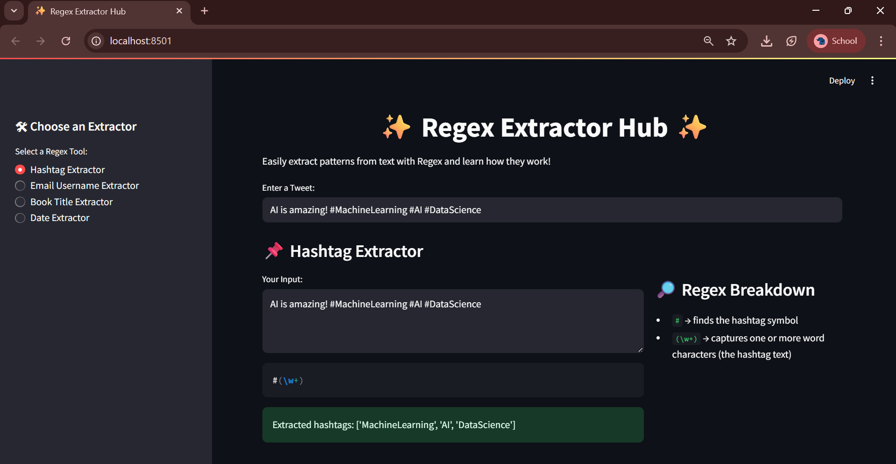
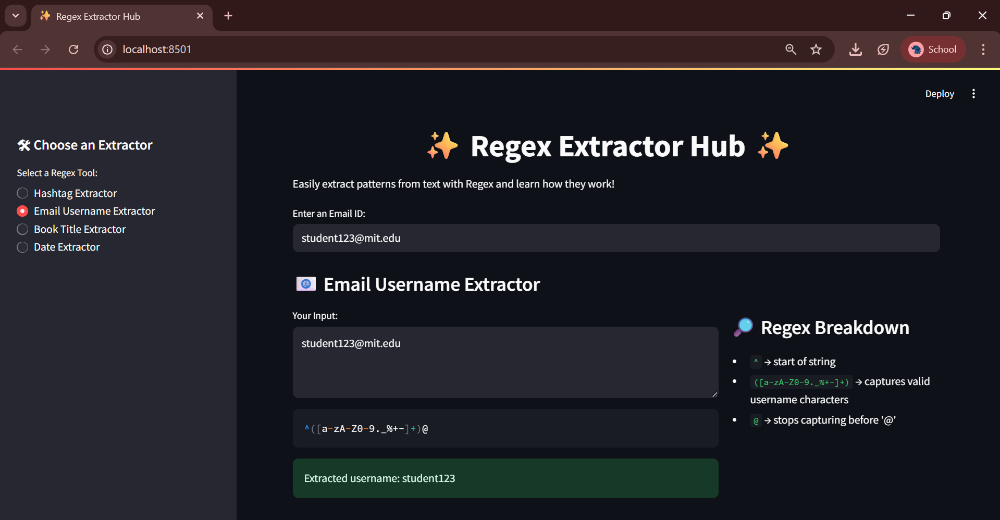
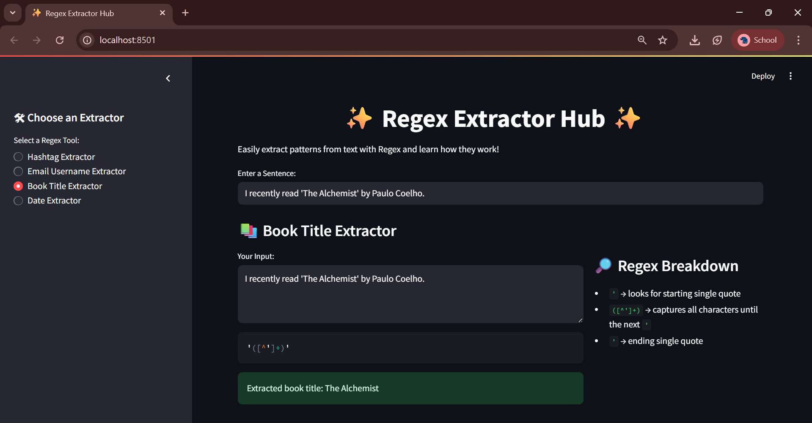
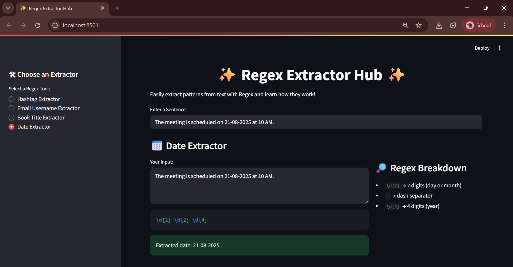

# ✨ Regex Extractor Hub ✨

A simple and interactive **Streamlit app** that helps you extract useful patterns (hashtags, email usernames, book titles, dates) using **Regular Expressions (Regex)**.  
It also explains **how each regex works** in an easy-to-understand way.

---

## 🚀 Features
- 📌 **Hashtag Extractor** → Extract hashtags from tweets/posts  
- 📧 **Email Username Extractor** → Get the username part of an email  
- 📚 **Book Title Extractor** → Extract book titles inside quotes  
- 📅 **Date Extractor** → Detect dates in `dd-mm-yyyy` format  
- 🔎 Regex explanation included for learning  

---

## 📸 Screenshots

### 📌 Hashtag Extractor


### 📧 Email Username Extractor


### 📚 Book Title Extractor


### 📅 Date Extractor



## 📦 Installation & Usage

Clone the repository:

```bash
git clone https://github.com/arpithagh/regex-extractor-hub.git
cd regex-extractor-hub
```

## Create a virtual environment (optional but recommended):

```bash
python -m venv venv
source venv/bin/activate   # On macOS/Linux
venv\Scripts\activate      # On Windows
```

## Install dependencies:

```bash
pip install -r requirements.txt
```

## Run the app:

```bash
streamlit run app.py
```

